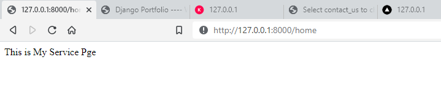

# Service Site Using Django-Apparky


> In this Django Project we have designed a Service Site 
> 
> We have agreed the terms and conditions of [Bootstrap](https://getbootstrap.com/) and have used free [Bootstrap](https://getbootstrap.com/) Templates in our work.
> 
> &nbsp; &nbsp; &nbsp; &nbsp; &nbsp; &nbsp; &nbsp; Bootstrap is a free, open source front-end development framework for the creation of websites and web apps. 
> Designed to enable responsive development of mobile-first websites, Bootstrap provides a collection of syntax for template designs.
> 
> 
> 

## Step 1:

Create a Folder first and open it from `CMD` (Windows) or your native `terminal`

Install [`Django`](https://www.djangoproject.com/) to your system by using this `command`

```commandline
pip install django
```

We have shared `requirement.txt` file with this repo. You can also install all required libraries by following this command

```commandline
pip install -r requirement.txt
```

If done, create a new project file by typing this

```commandline
django-admin startproject YOURPROJECTNAME .
# In this project is the name of it is ServiceWeb.
```

That's all. All your Native file will be created to yhe folder, and you are ready to start

## Step 2:

Now open the project file with the `IDLE` you like to use

Open the `terminal` from your `IDLE` and type 

```commandline
python manage.py runserver
```

> And you are good to go. Open this link form you browser [http://localhost:8000/](http://localhost:8000/)
> 
> You will see the `server` is running
> 
> 

Now Let's Create an application for our Ecommerce Page.

For Creating an Application type this to your `terminal`

```commandline
python manage.py startapplications YOURAPPLICATIONNAME
# In this project your application name is myService
```

You can see now a new folder has been created to your project directory

Now go to `ServiceWeb/settings.py` file you will find some list of installed application there

```commandline
INSTALLED_APPS = [
    'django.contrib.admin',
    'django.contrib.auth',
    'django.contrib.contenttypes',
    'django.contrib.sessions',
    'django.contrib.messages',
    'django.contrib.staticfiles',    
]
```

add the application name and save the file

```commandline
INSTALLED_APPS = [
    'django.contrib.admin',
    'django.contrib.auth',
    'django.contrib.contenttypes',
    'django.contrib.sessions',
    'django.contrib.messages',
    'django.contrib.staticfiles',
    
    'myService',     # app name has to insert here to make it work
]
```

like this

Now go to the `TEMPLATES` section and alter the `code` with the given billow `code`
```commandline
TEMPLATES = [
    {
        'BACKEND': 'django.template.backends.django.DjangoTemplates',
        'DIRS': [BASE_DIR, os.path.join(BASE_DIR, 'templates')],
        'APP_DIRS': True,
        'OPTIONS': {
            'context_processors': [
                'django.template.context_processors.debug',
                'django.template.context_processors.request',
                'django.contrib.auth.context_processors.auth',
                'django.contrib.messages.context_processors.messages',
            ],
        },
    },
]
```

Now go to the `STATIC_URL` section and alter it with the given billow code
```commandline
STATIC_URL = '/static/'

MIDEA_URL = '/midea/'
MIDEA_ROOT = os.path.join(BASE_DIR, 'midea')

STATICFILES_DIRS = [
    os.path.join(BASE_DIR, 'static')
]
```
don't forget to `import os` at the top of the code.

Your `ServiceWeb/settings.py` has been doe setting up. Now go to `ServiceWeb/urls.py` and connect application url with the project.
Copy and Paste the given code to your `ServiceWeb/urls.py` file
```commandline
from django.contrib import admin
from django.urls import path, include

urlpatterns = [
    path('admin/', admin.site.urls),
    path('', include('myService.urls'))
]
```

You are all set up for the project directory. Let's go to the next shep

## Step 3:
In this step we are going to set up `myService/views.py`, create and setup `myService/urls.py`

Let's go to `myService/view.py` and copy & paste the following code into it
```commandline
from django.shortcuts import render, redirect
from django.http import HttpResponse

def index(request):
    return HttpResponse('This is My Service Pge')
```

`myService/views.py` returns the web view, `myService/urls.py` create the `url` for that

Now go to the `myService/urls.py` and copy and paste the following 
```commandline
from django.urls import path
from . import views

urlpatterns = [
    path('home', views.home, name='home'),
]
```

Now run the server by the following `command` to see the web page

```commandline
python manage.py runserver
```

Click on this link [http://localhost:8000/test/](http://localhost:8000/test/)

This is how it looks like



Your basic app has been set up. Now let's go to next Step

## Step 4:

As we mention before, We use Bootstrap Templates for this project. 
Now put all `.html` files to the `templates` folder and others into the `static` folder 


---------------------------------------------------------------------