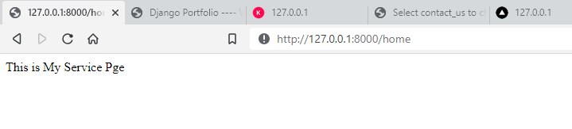

## Step 3:
In this step we are going to set up `myService/views.py`, create and setup `myService/urls.py`

Let's go to `myService/view.py` and copy & paste the following code into it
```commandline
from django.shortcuts import render, redirect
from django.http import HttpResponse

def index(request):
    return HttpResponse('This is My Service Pge')
```

`myService/views.py` returns the web view, `myService/urls.py` create the `url` for that

Now go to the `myService/urls.py` and copy and paste the following 
```commandline
from django.urls import path
from . import views

urlpatterns = [
    path('home', views.home, name='home'),
]
```

Now run the server by the following `command` to see the web page

```commandline
python manage.py runserver
```

Click on this link [http://localhost/test/](http://localhost/test/)

This is how it looks like



Your basic app has been set up. Now let's go to next project
